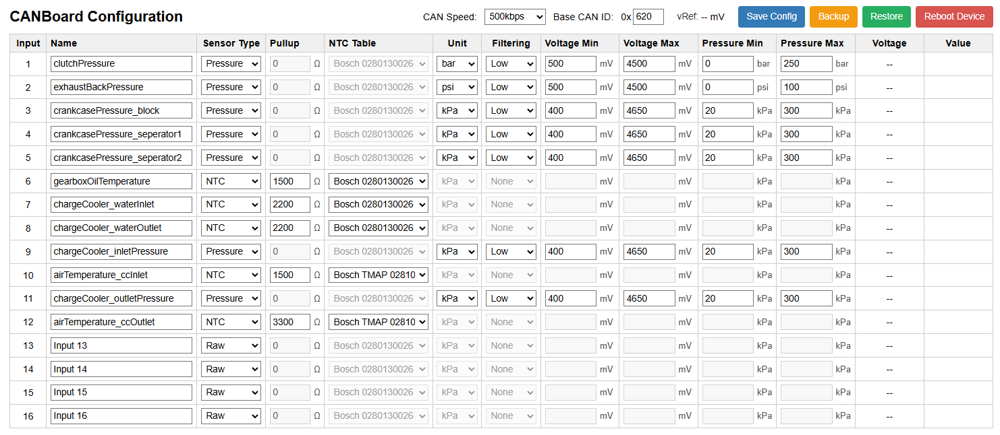
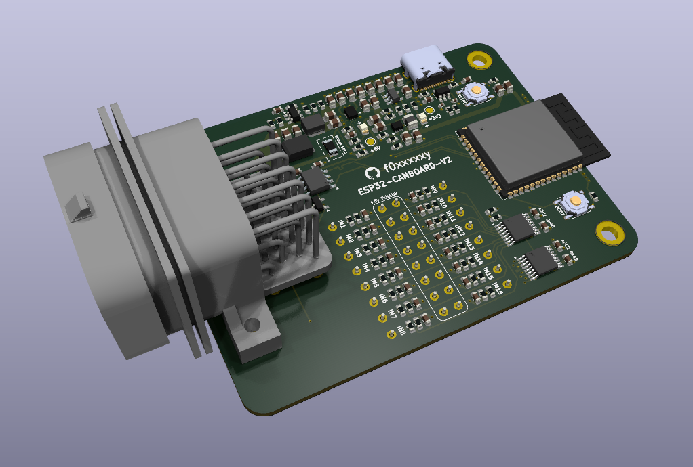
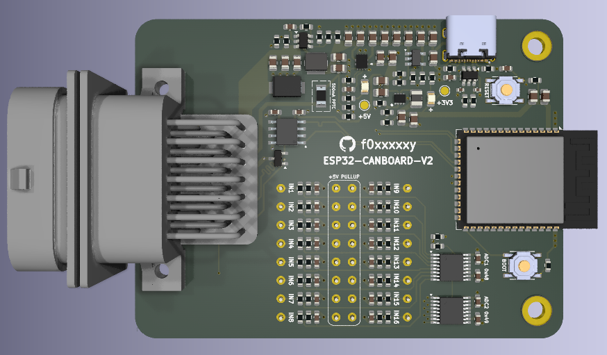
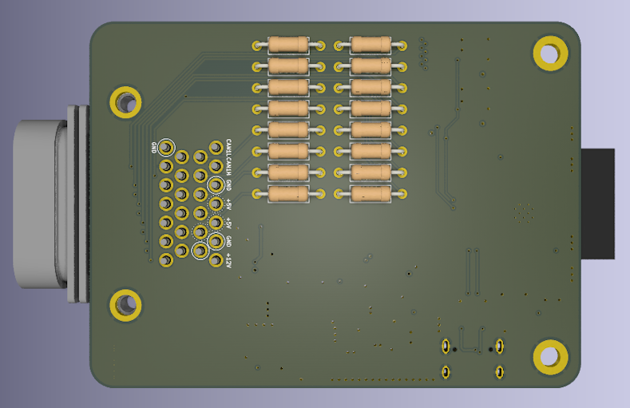

# ESP32-CANBoard
* ESP32-S3 Dual Core SoC
* MCP2562T CAN Transceiver (up to 1Mbps)
* 16x 5V-tolerant Inputs via two ADS7830 I2C expanders (16 analog channels)
* Internal 5V rail reference for accurate output calculation
* 2x 5V Outputs - Fused at 500mA (Thermal Reset)
* USB-C for programming, with JTAG support for debugging
* ESD Protection on both USB and CAN
* TE Connectivity AMP 26 Way SuperSeal Connector (PCB Socket: 9-6437287-8, Cable Plug: 3-1437290-7)
* Optional pull-up resistors via fused 5V rail for each input (TH 6.3mm)
* Configuration via web interface over WiFi
* Optional per-channel median filtering with selectable strength (none/low/med/high) to reduce noise

## Device Configuration

On each boot the board enables a WiFi access point and web configuration interface; this will automatically disable after 120 seconds if no client connects.

| SSID | WPA2 Key | Web UI |
|:---|:---|:---|
| ESP32-CanBoard | canboard123 | http://192.168.4.1 |

The web UI allows you to:

- View and edit per-channel settings (name, sensor type, pull-up, pressure unit, filter level, voltage and pressure calibration).
- Configure required CAN parameters - Base ID and bus speed.
- View current 5V rail reference, input voltages and calculated values in real time.
- Backup the entire configuration to a JSON file.
- Restore configuration from a previously exported JSON file.

| Function | Description |
|:----|:----|
| Save Config | Save current UI settings to device storage (`/spiffs/config.bin`). Changes are validated, persisted and applied immediately. |
| Backup | Download a JSON snapshot of the current configuration. The filename is prefixed with `esp32-canboard-config-` and suffixed with the client timestamp in `ddmmyy-hhmmss` format. |
| Restore | Select a previously exported JSON file. The UI will upload the JSON to the device and validate the payload. The existing configuration is backed up on the device before overwrite; if saving the imported file fails, the device will restore the previous configuration. |
| Reboot Device | Reboots the device. |

**Notes:**
- Configuration is persisted on SPIFFS at `/spiffs/config.bin` (binary) and the web UI uses JSON export/import for human-readable backups.

## CAN Output

The device transmits input data as a set of eight CAN frames starting at the configured base ID. All frames use DLC=8 and little-endian byte ordering.

Overview:
- Frames 0..3 (Base ID .. Base ID+3): packed analog voltages for all 16 channels, 4 channels per frame, each channel as uint16 (millivolts, LSB then MSB).
- Frames 4..7 (Base ID+4 .. Base ID+7): packed dynamic values for all 16 channels, 4 values per frame, each as uint16. Dynamic values are sensor-type dependent (zeros where not applicable).

Detailed layout:

| CAN ID | Contents |
|:---|:---|
| Base ID + 0 | Channels 0..3 → ch0 (bytes 0..1 LSB/MSB), ch1 (2..3), ch2 (4..5), ch3 (6..7) — analog mV uint16 |
| Base ID + 1 | Channels 4..7 — analog mV uint16 |
| Base ID + 2 | Channels 8..11 — analog mV uint16 |
| Base ID + 3 | Channels 12..15 — analog mV uint16 |
| Base ID + 4 | Dynamic 0..3 — per-channel dynamic outputs (uint16) |
| Base ID + 5 | Dynamic 4..7 — per-channel dynamic outputs (uint16) |
| Base ID + 6 | Dynamic 8..11 — per-channel dynamic outputs (uint16) |
| Base ID + 7 | Dynamic 12..15 — per-channel dynamic outputs (uint16) |

Encoding rules for dynamic values (one per input):
| Type | Encoding |
|:---|:---|
| Raw | uint16 = 0 (no dynamic output; use analog voltage frame) |
| Pressure | uint16 = pressure_kPa * 100 (resolution 0.01 kPa) |
| NTC | signed int16 = temperature_C (°C as integer) stored in uint16 (least-significant 16 bits) |

Receivers should interpret all measurement values as little-endian uint16s unless noted. Dynamic outputs use live V5 for conversions where applicable.

Example DBC for signal names and scaling: [dbc/esp32-canboard.dbc](dbc/esp32-canboard.dbc)

## Schematic
[View PDF](docs/esp32-canboard-schematic.pdf)

## Images

